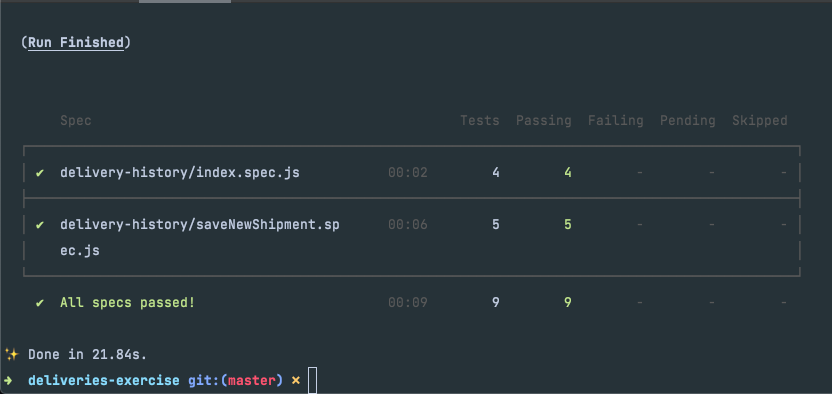

# Deliveries exercise using TDD

**Project where you can see the list of shipments, create new shipment, while all shipment's data would be stored locally in localStorage.**

###Technologies
- React
- Cypress
- React testing library
- Storybook
- styled-components

## Available Scripts

In the project directory, you can:
- start
- run testing
- run storybook

### `yarn start`

Runs the app in the development mode.\
Open [http://localhost:3000](http://localhost:3000) to view it in the browser.

### `yarn storybook`

Launches Storybook project to see components created.\

### `yarn cy:open`

Launches the Cypress UI mode window\

### `yarn cy:terminal`

Runs Cypress tests in headless mode.\
There are the tests you'll fine:

*1.- delivery-history/index.spec.js*
- [x] should see delivery history layout
- [x] should order deliveries by fakeTimestamp
- [x] should show delivery details when user clicks on Details button
- [x] should show local storage shipments

*2.- delivery-history/saveNewShipment.spec.js*
- [x] should not store nothing and clear modal form if user click cancel
- [x] should store new delivery in context api
- [x] should store new delivery in localStorage
- [x] should show recently added shipment at beginning
- [x] should show error messages for required fields

**This project was bootstrapped with [Create React App](https://github.com/facebook/create-react-app).**
